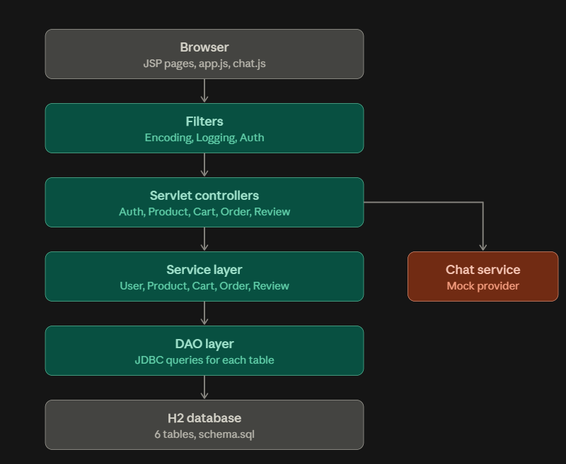
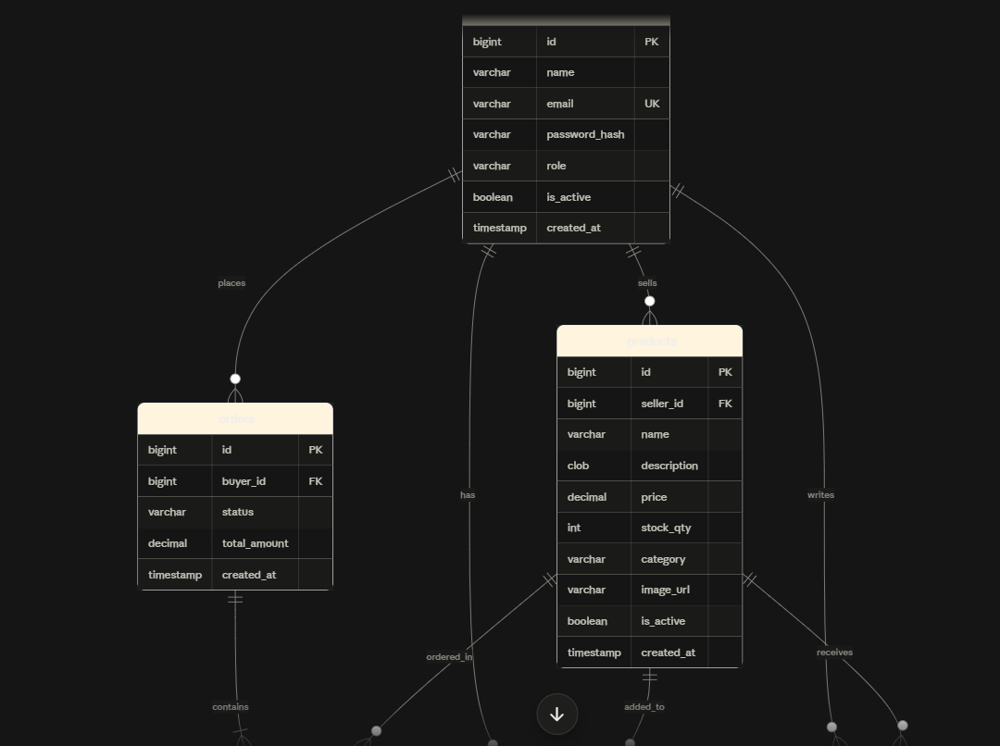
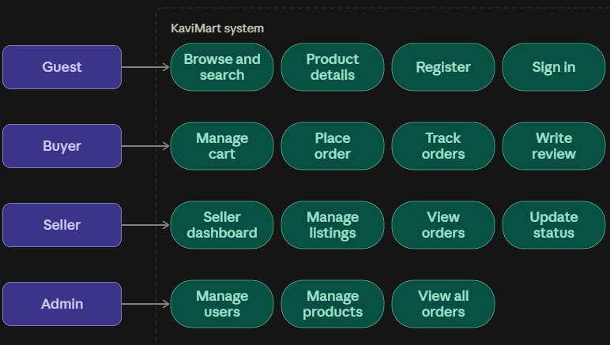
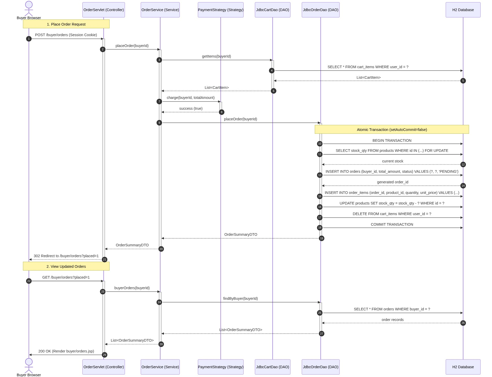

# KaviMart

KaviMart is a multi-seller marketplace with separate buyer, seller, and admin workflows. It is built as a Java 17 Maven WAR using Servlet 4, JSP/JSTL, JDBC, H2, and plain CSS/JavaScript. A built-in helper chatbot answers common questions about orders, the bag, reviews, and selling.

## Live Deployment

- **Deployed URL:** [https://your-deployment-url-here.example.com](https://your-deployment-url-here.example.com) *(Placeholder: update with your deployed Tomcat / Render / Cloud URL)*

## Features

- **Accounts:** buyer and seller registration, BCrypt login, session ID rotation, and active-account checks.
- **Catalog:** public search, category and price filters, paging, and product detail pages. Prices are shown in rupees.
- **Buyer:** stock-limited cart, transactional checkout, order history, cancellation of pending orders (stock is restored), and verified-purchase reviews.
- **Seller:** dashboard, product listings (add, edit, remove), and order status progression.
- **Admin:** ban or activate member accounts, view all orders, and remove listings.
- **Chatbot:** floating "Ask KaviMart" helper on every page. Supports Google Gemini API (`GeminiChatProvider`) with server-side API key protection and fallback to a deterministic offline FAQ provider (`MockChatProvider`). Includes session caching and a 10 messages/minute rate limit.
- **API:** health check and versioned JSON endpoints under `/api/v1/` following standard response envelopes.
- **Soft delete:** users and products have an `is_active` flag, so old orders stay valid after a listing is removed.

## Technology

| Area | Technology |
| --- | --- |
| Runtime / packaging | Java 17, Maven, WAR |
| Web | Servlet 4.0.1 (javax), JSP, JSTL 1.2 |
| Database | H2 2.2 (embedded file mode; in-memory for tests) |
| Connection pooling | HikariCP |
| Password hashing | jBCrypt |
| JSON / logging | Gson, SLF4J, Logback |
| AI Integration | Java HTTP Client, Google Gemini API |
| Tests and quality | JUnit 5, Mockito, Checkstyle, SpotBugs |
| Development server | Embedded Tomcat 9 (dev profile only) |
| Deployment | Apache Tomcat 9; a Dockerfile for Tomcat 9 is included |

## Design

### D1: Architecture Diagram

Requests pass through three filters (encoding, logging, authentication and role check), then a servlet controller, a service, and a DAO that talks to the H2 database. The chat servlet uses its own chat service with a pluggable provider.



### D2: Database (ER Diagram)

Entity-Relationship diagram matching `src/main/resources/db/schema.sql`, including `is_active` soft-delete flags on users and products. Versioned schema changes are in `src/main/resources/db/migrations/` (V1 to V4).



### Use Cases Diagram

Actor and workflow interactions for Guest, Buyer, Seller, and Admin across all core features (F1–F8).



### D3: Sequence Diagram (Place-Order Flow)

End-to-end transactional place-order lifecycle: Browser &rarr; `OrderServlet` &rarr; `OrderService` &rarr; `PaymentStrategy` &rarr; `JdbcCartDao` / `JdbcOrderDao` &rarr; H2 Database (atomic transaction with stock validation, deduction, and cart clearance) and the response redirect path back. Source definition in `docs/sequence-diagram.mmd`.



## Screenshots

Place captured interface screenshots in `docs/screenshots/`:

| Screen | File Placeholder | Description |
| --- | --- | --- |
| **Catalog & Search** | `docs/screenshots/01-catalog.png` | Public marketplace browsing with search and category filters |
| **Product Detail & Reviews** | `docs/screenshots/02-product-detail.png` | Item specifications, seller details, stock count, and reviews |
| **Shopping Bag** | `docs/screenshots/03-cart.png` | Quantity modification and live subtotal computation |
| **Order History** | `docs/screenshots/04-buyer-orders.png` | Placed orders and order lifecycle tracking |
| **Seller Dashboard** | `docs/screenshots/05-seller-dashboard.png` | Revenue stats, product inventory, and order status progression |
| **Admin Moderation** | `docs/screenshots/06-admin-console.png` | User activation/bans and listing management |
| **AI Assistant** | `docs/screenshots/07-chatbot.png` | Real-time question answering with rate limit and caching |

## Project structure

```
src/main/java/com/kavi/kavimart/
  controller/   servlets (auth, catalog, cart, orders, reviews, admin, chat, API)
  service/      business rules, plus service/ai for the chatbot
  dao/          JDBC data access
  model/        User, Product, CartItem, Review and query helpers
  dto/          request and response objects
  filter/       Encoding, Logging, Auth filters
  listener/     AppContextListener (starts the database and wires singletons)
  exception/    custom exceptions
  util/         helpers
src/main/resources/db/   schema.sql, seed.sql, migrations/
src/main/webapp/         JSP views (WEB-INF/jsp) and assets (CSS, JS)
docs/                    Architecture, ER, sequence diagrams, and test specifications
```

## Run locally

Prerequisites: JDK 17 and Maven 3.8+.

Recommended: set the seed password before the first start. All demo accounts use it.

```powershell
$env:SEED_PASSWORD = "choose-a-password"
```

If `SEED_PASSWORD` is not set, the accounts are seeded with a local development password and a warning is logged. Seeding happens only when the database is empty, so to change the password later, stop the app and delete the H2 database files (by default `./data/kavimart`, relative to where the app is started). This removes all data.

Build and run with the embedded Tomcat (dev profile):

```sh
mvn clean verify
mvn package exec:java
```

Open http://localhost:8080. The H2 database is created under `data/kavimart`.

Optional settings: `JDBC_URL`, `JDBC_USER`, `JDBC_PASSWORD`, `PORT`, `AI_CHATBOT_PROVIDER`, and `GEMINI_API_KEY`. You can copy `.env.example` to `.env` or set system environment variables.

## Deploy on Tomcat 9 (Windows)

The script `deploy-local.ps1` builds the WAR, copies it to Tomcat, starts Tomcat, and checks that the app responds.

1. Open `deploy-local.ps1` and set `$project` (this folder) and `$tomcat` (your Tomcat 9 folder) at the top.
2. Run:

```powershell
powershell -ExecutionPolicy Bypass -File .\deploy-local.ps1
```

3. Open http://localhost:8080/kavimart/

If the script says a port is busy, close the old Tomcat window and run it again. To deploy by hand, run `mvn clean package -DskipTests` and copy `target/kavimart.war` to Tomcat's `webapps` folder.

## Demo accounts

| Role | Email |
| --- | --- |
| Admin | admin@kavimart.com |
| Seller | seller1@kavimart.com, seller2@kavimart.com |
| Buyer | buyer1@kavimart.com, buyer2@kavimart.com |

The password is the value of `SEED_PASSWORD` that was set when the database was first created, or the local development password if it was not set. Passwords are stored as BCrypt hashes. Always set your own `SEED_PASSWORD` before any real deployment.

## Test

`mvn clean verify` runs 85+ automated tests:
- DAO tests against in-memory H2 database.
- Service unit tests with Mockito.
- Servlet and Filter tests with HTTP mock objects.
- Security tests verifying SQL injection and XSS neutralization.
- Chatbot provider and rate limiter tests.

## Known Limitations

1. **H2 Embedded File Mode:** The application uses H2 in embedded file mode (`./data/kavimart;AUTO_SERVER=TRUE`) rather than standalone client-server mode. While ideal for capstone evaluation and local setups, horizontal clustering across multiple separate server nodes requires migrating to a dedicated database server (e.g. PostgreSQL or MySQL).
2. **Ephemeral Cloud Storage:** On free container hosting platforms (such as Render or Fly.io free tiers without persistent disk attachments), local filesystem files reset whenever containers restart or sleep, reverting seed data back to the initial state.
3. **Mock Payment Strategy:** Checkout executes against a simulated `MockPaymentStrategy`. Real money is not captured; integrating production UPI/Card payments requires onboarding a merchant gateway like Razorpay or Stripe.
