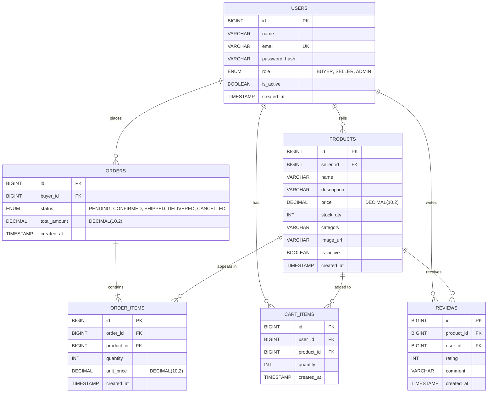

# D1: ER Diagram

Entity-relationship diagram of the KaviMart database (see `src/main/resources/db/schema.sql`).

```mermaid
erDiagram
    USERS ||--o{ PRODUCTS : sells
    USERS ||--o{ ORDERS : places
    USERS ||--o{ CART_ITEMS : has
    USERS ||--o{ REVIEWS : writes
    ORDERS ||--|{ ORDER_ITEMS : contains
    PRODUCTS ||--o{ ORDER_ITEMS : "appears in"
    PRODUCTS ||--o{ CART_ITEMS : "added to"
    PRODUCTS ||--o{ REVIEWS : receives

    USERS {
        BIGINT id PK
        VARCHAR name
        VARCHAR email UK
        VARCHAR password_hash
        ENUM role "BUYER, SELLER, ADMIN"
        BOOLEAN is_active
        TIMESTAMP created_at
    }
    PRODUCTS {
        BIGINT id PK
        BIGINT seller_id FK
        VARCHAR name
        VARCHAR description
        DECIMAL price "DECIMAL(10,2)"
        INT stock_qty
        VARCHAR category
        VARCHAR image_url
        BOOLEAN is_active
        TIMESTAMP created_at
    }
    ORDERS {
        BIGINT id PK
        BIGINT buyer_id FK
        ENUM status "PENDING, CONFIRMED, SHIPPED, DELIVERED, CANCELLED"
        DECIMAL total_amount "DECIMAL(10,2)"
        TIMESTAMP created_at
    }
    ORDER_ITEMS {
        BIGINT id PK
        BIGINT order_id FK
        BIGINT product_id FK
        INT quantity
        DECIMAL unit_price "DECIMAL(10,2)"
        TIMESTAMP created_at
    }
    CART_ITEMS {
        BIGINT id PK
        BIGINT user_id FK
        BIGINT product_id FK
        INT quantity
        TIMESTAMP created_at
    }
    REVIEWS {
        BIGINT id PK
        BIGINT product_id FK
        BIGINT user_id FK
        INT rating
        VARCHAR comment
        TIMESTAMP created_at
    }
```